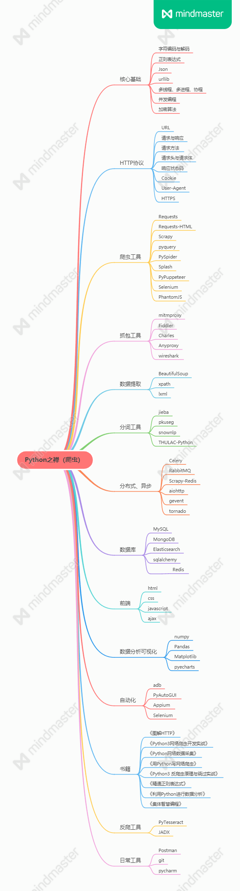

「Python爬虫学习+面试指南」一份涵盖大部分Python爬虫工程师所需要掌握的核心知识。

# 目录 （善用Ctrl+F）

- Python核心基础

    - [Python 中的字符编码为什么那么蛋疼？](https://mp.weixin.qq.com/s?__biz=MjM5MzgyODQxMQ==&mid=2650366836&idx=1&sn=da43cd0208b6bb7b1c51c5ced3ac1027&chksm=be9cd82089eb5136830ba25a54ae57a5fc1ca105b68718fcf4d9f100ddb1ea18120990c47816#rd)
    - [Python3中，是如何解决棘手的字符编码问题的？](https://mp.weixin.qq.com/s?__biz=MjM5MzgyODQxMQ==&mid=2650366846&idx=1&sn=ff9f9f4b7bf8a59afa39b60707ed35c9&chksm=be9cd82a89eb513cc96630c2f1072519d85f474a9f1028749150306110d539cb0dba410b5859#rd)
    - [字符编码的前世今生](https://foofish.net/python-character-encode.html)

- 爬虫基本原理

    - [爬虫基本原理](./爬虫基本原理.md)
    - [用 Python 处理 HTML 转义字符的5种方式](https://mp.weixin.qq.com/s?__biz=MjM5MzgyODQxMQ==&mid=2650367619&idx=1&sn=0ce381e43cbbe4b0646d0214e461ce16&chksm=be9cddd789eb54c1838716d0a00fee71c2d1b1f42b09603af937ee9b274adf50b652bc88720f#rd)
    - [用BeautifulSoup处理HTML文本](https://mp.weixin.qq.com/s?__biz=MjM5MzgyODQxMQ==&mid=2650366919&idx=1&sn=1b36a9f2c0921cdeac52942ec591a923&chksm=be9cd89389eb5185d32ab5e9034c2e68ddff6c2f8ddeaee1662499d73baf113fd5ec645548f8#rd)

    - [requests 快速上手](https://mp.weixin.qq.com/s?__biz=MjM5MzgyODQxMQ==&mid=2650366885&idx=1&sn=37d9c9ff3ad777ac03259805abd84ae3&chksm=be9cd8f189eb51e7affb6c127429b2d855342e19cb8d1b1fb97dd549fe66f03febde84182db7&token=474682597&lang=zh_CN#rd)

    - [json](https://realpython.com/python-json/)